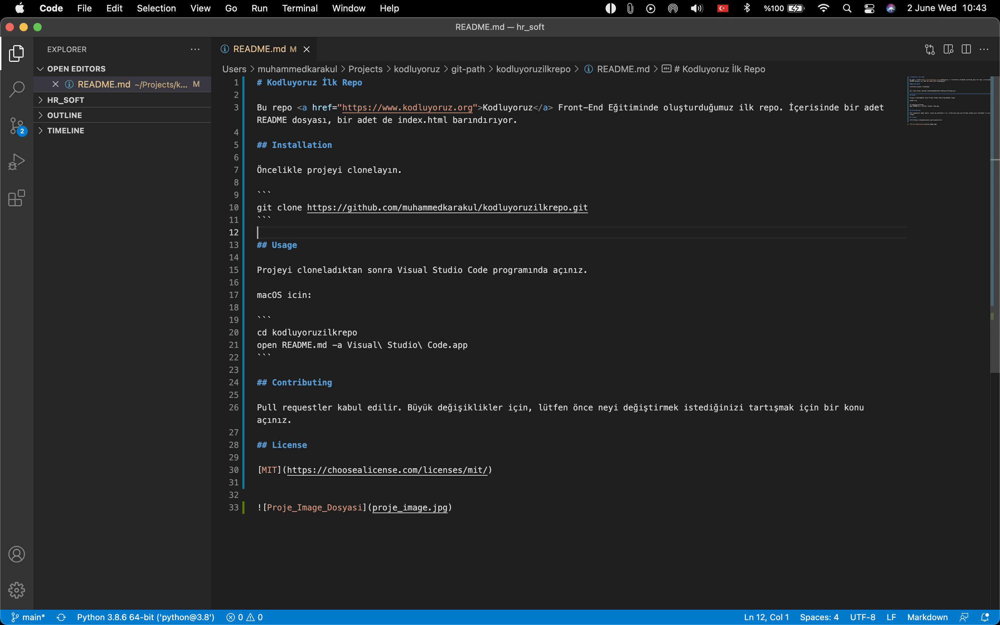

# Kodluyoruz İlk Repo

Bu repo <a href="https://www.kodluyoruz.org">Kodluyoruz</a> Front-End Eğitiminde oluşturduğumuz ilk repo. İçerisinde bir adet README dosyası, bir adet de index.html barındırıyor.

## Installation

Öncelikle projeyi clonelayın.

```
git clone https://github.com/muhammedkarakul/kodluyoruzilkrepo.git
```

## Usage

Projeyi cloneladıktan sonra Visual Studio Code programında açınız. 

macOS icin: 

```
cd kodluyoruzilkrepo
open README.md -a Visual\ Studio\ Code.app
```

## Contributing 

Pull requestler kabul edilir. Büyük değişiklikler için, lütfen önce neyi değiştirmek istediğinizi tartışmak için bir konu açınız. 

## License

[MIT](https://choosealicense.com/licenses/mit/)


